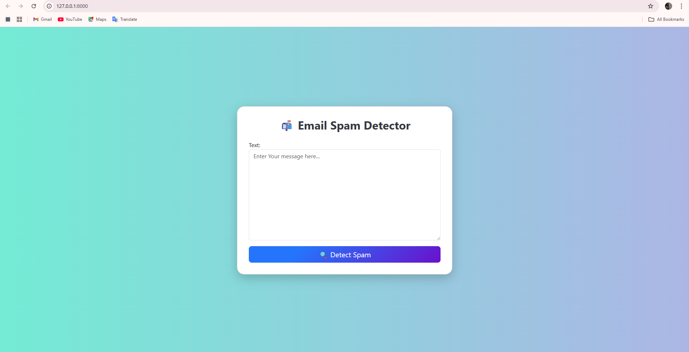

# 📧 Email Spam Detector

This is a Django-based web application that uses a machine learning model to detect whether a given email message is **Spam** or **Not Spam**. It provides a clean UI where users can input email content and instantly get predictions.

---

## 🚀 Features

- 🔍 Spam detection using a trained ML model  
- 📄 Text input via web form  
- ✅ Instant classification as "Spam" or "Not Spam"  
- 🎨 Styled using Bootstrap 5 for a clean user interface  
- 🧠 Model and vectorizer loaded using `pickle`

---

## 🛠️ Tech Stack

- **Backend**: Python, Django  
- **Frontend**: HTML, CSS, Bootstrap 5  
- **ML**: Scikit-learn, Pickle  
- **Deployment**: GitHub (Local for now)

---

## 📁 Project Structure

<pre> email-spam-detector/ ├── Detector/ # Django app (views, forms, etc.) │ ├── __init__.py │ ├── admin.py │ ├── apps.py │ ├── forms.py # Django form for message input │ ├── migrations/ │ ├── models.py │ ├── tests.py │ ├── views.py # Main logic for prediction │ └── templates/ │ └── Detector/ │ └── predict.html # UI template │ ├── SpamDetector/ # Project settings folder │ ├── __init__.py │ ├── asgi.py │ ├── settings.py # Django settings │ ├── urls.py # Root URLs │ └── wsgi.py │ ├── Models/ # Folder containing trained model │ ├── model.pkl │ └── vectorizer.pkl │ ├── db.sqlite3 # SQLite database ├── manage.py # Django management script ├── requirements.txt # Python dependencies ├── ui_screenshot.png # 📸 UI screenshot (for README) └── README.md # Project documentation </pre>
